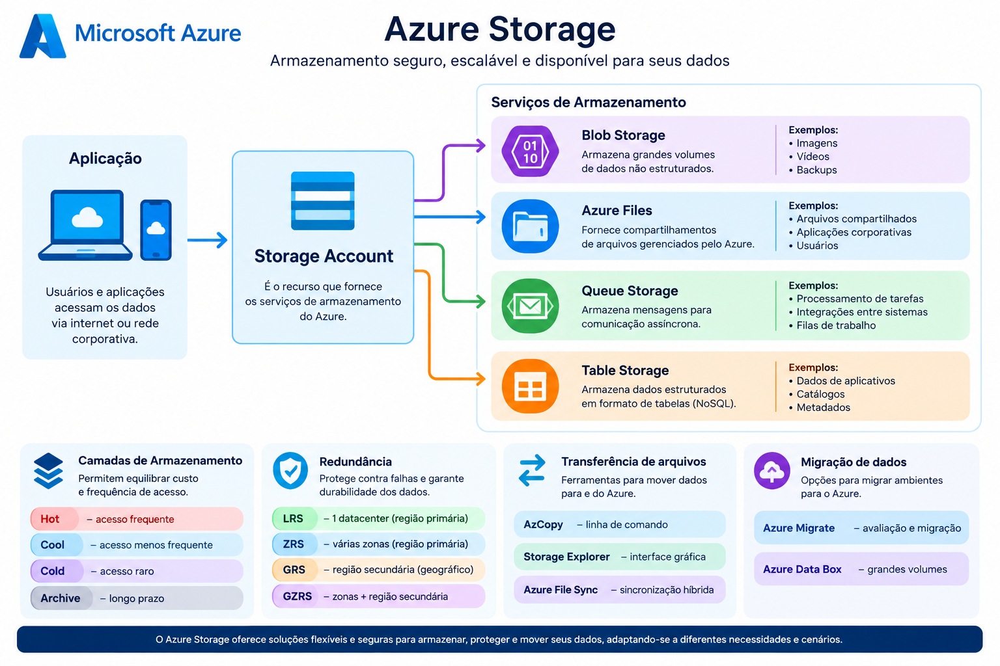

# 💾 Azure Storage


## 🎯 Objetivo

Neste módulo foram estudados os principais serviços de armazenamento do Microsoft Azure, entendendo como as contas de armazenamento organizam os dados e como diferentes opções de redundância, transferência e migração podem ser utilizadas de acordo com cada cenário.

---

## 📚 Serviços de armazenamento estudados

### Storage Account

A **Azure Storage Account** é o recurso utilizado para disponibilizar os serviços de armazenamento do Azure.

Uma conta de armazenamento pode disponibilizar diferentes tipos de armazenamento, como:

- Blob Storage
- Azure Files
- Queue Storage
- Table Storage

A configuração de redundância é definida na conta de armazenamento e é compartilhada pelos serviços de armazenamento associados a ela.

---

## 🗂️ Tipos de armazenamento

### Blob Storage

O **Azure Blob Storage** é utilizado para armazenar grandes quantidades de dados não estruturados.

Exemplos:

- Imagens
- Vídeos
- Documentos
- Backups
- Logs
- Arquivos de aplicação

---

### Azure Files

O **Azure Files** fornece compartilhamentos de arquivos gerenciados pelo Azure.

Pode ser utilizado em cenários nos quais aplicações ou usuários precisam acessar arquivos compartilhados.

---

### Queue Storage

O **Queue Storage** permite armazenar mensagens para comunicação assíncrona entre componentes de aplicações.

Um exemplo seria uma aplicação que coloca tarefas em uma fila para serem processadas posteriormente.

---

### Table Storage

O **Table Storage** fornece armazenamento NoSQL para dados estruturados em formato de tabelas.

É adequado para determinados cenários que precisam armazenar grandes quantidades de dados estruturados sem utilizar um banco de dados relacional tradicional.

---

## 🗄️ Camadas de armazenamento

O Azure Blob Storage possui diferentes camadas de acesso que permitem equilibrar custo e frequência de acesso aos dados.

| Camada | Utilização |
|---|---|
| **Hot** | Dados acessados frequentemente |
| **Cool** | Dados acessados com menor frequência |
| **Cold** | Dados acessados raramente |
| **Archive** | Dados que precisam ser armazenados por longos períodos e raramente acessados |

A escolha da camada deve considerar principalmente a frequência de acesso e o custo de armazenamento e recuperação.

---

## 🔄 Redundância

O Azure Storage mantém múltiplas cópias dos dados para aumentar a durabilidade e protegê-los contra falhas de hardware, rede, energia e outros eventos.

### LRS — Locally Redundant Storage

Mantém cópias dos dados dentro de um único datacenter na região primária.

**Indicado quando:**

- O custo precisa ser reduzido;
- A proteção contra falhas dentro do datacenter é suficiente;
- Não existe necessidade de proteção contra uma falha regional.

---

### ZRS — Zone-Redundant Storage

Replica os dados de forma síncrona entre zonas de disponibilidade na região primária.

**Indicado quando:**

- É necessária maior disponibilidade;
- A aplicação precisa continuar funcionando mesmo com a indisponibilidade de uma zona.

---

### GRS — Geo-Redundant Storage

Mantém a redundância na região primária e replica os dados de forma assíncrona para uma região secundária geograficamente distante.

**Indicado para:**

- Recuperação de desastres;
- Proteção contra indisponibilidade regional.

---

### GZRS — Geo-Zone-Redundant Storage

Combina redundância entre zonas na região primária com replicação para uma região secundária.

É uma opção para cenários que precisam combinar alta disponibilidade na região primária e proteção contra falhas regionais.

---

### Comparação

```text
                    REGIÃO PRIMÁRIA
                         │
          ┌──────────────┼──────────────┐
          │              │              │
         LRS            ZRS            GRS/GZRS
          │              │              │
     1 datacenter    Várias zonas    Região secundária
                                         │
                                         ▼
                                  Proteção regional
```

**Resumo para o AZ-900:**

- **LRS** = local
- **ZRS** = zonas
- **GRS** = geográfico
- **GZRS** = zonas + geográfico

---

## 🚚 Movimentação de arquivos

O Azure disponibiliza diferentes ferramentas para movimentação de dados.

### AzCopy

Ferramenta de linha de comando utilizada para copiar dados de e para o Azure Storage.

É especialmente útil para transferências automatizadas e baseadas em scripts.

---

### Azure Storage Explorer

Aplicação gráfica que permite gerenciar e trabalhar com recursos de armazenamento do Azure.

É uma alternativa mais visual para administrar arquivos e outros recursos de armazenamento.

---

### Azure File Sync

Permite sincronizar servidores de arquivos Windows com o Azure Files.

Pode ser utilizado em ambientes híbridos, mantendo dados disponíveis localmente enquanto utiliza o Azure como camada de armazenamento.

---

## 🚛 Migração de dados

Durante o módulo também foram estudadas opções para migração de dados para o Azure.

### Azure Migrate

Serviço utilizado para auxiliar na avaliação e migração de ambientes para o Azure.

---

### Azure Data Box

Utilizado para transferência de grandes volumes de dados utilizando dispositivos físicos.

É especialmente interessante quando transferir grandes quantidades de dados pela rede não é a opção mais adequada.

---

## 🧠 O que aprendi

Neste módulo aprendi que o Azure oferece diferentes formas de armazenar, proteger e movimentar dados.

Os principais pontos que considero importantes para a certificação AZ-900 são:

- Entender a função de uma Storage Account;
- Diferenciar Blob, Files, Queue e Table Storage;
- Entender as camadas de acesso;
- Diferenciar LRS, ZRS, GRS e GZRS;
- Saber quando utilizar AzCopy;
- Conhecer o Azure Storage Explorer;
- Entender o objetivo do Azure File Sync;
- Diferenciar Azure Migrate e Azure Data Box.

---

## 🧪 Aplicação prática

Um cenário simples de arquitetura de armazenamento pode ser representado pela imagem abaixo:



Uma aplicação hospedada no Azure pode utilizar uma Storage Account para acessar diferentes serviços de armazenamento conforme a necessidade da aplicação.

---

## 📊 Avaliação

**Resultado da avaliação do módulo: 100%**

- **Status:** ✅ Aprovado
- **XP obtido:** 200 XP
- **Módulo concluído:** Descrever os serviços de armazenamento do Azure

---

## 📖 Documentação oficial

- [Microsoft Learn — Armazenar dados no Azure](https://learn.microsoft.com/pt-br/learn/paths/store-data-in-azure/)
- [Microsoft Learn — Azure Storage](https://learn.microsoft.com/pt-br/azure/storage/)
- [Microsoft Learn — Redundância do Azure Storage](https://learn.microsoft.com/pt-br/azure/storage/common/storage-redundancy)
- [Microsoft Learn — Azure Data Box](https://learn.microsoft.com/pt-br/azure/databox/)

---
> Este material faz parte do meu portfólio de estudos para a certificação **Microsoft Certified: Azure Fundamentals (AZ-900)**.
>
> Os conteúdos foram organizados a partir dos estudos realizados no Microsoft Learn e complementados com anotações e exemplos próprios.
